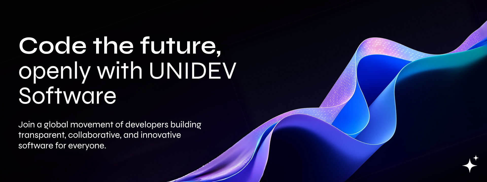

# 🚀 Unıdev Software

---

##  Our Mission

To establish a leading software development community that creates **valuable content** and fosters innovation. We strengthen Turkey's software ecosystem through knowledge sharing, collaborative learning, and professional development.

##  Our Vision

To become Turkey's premier software developer community, providing a comprehensive platform for developers at all levels to enhance their skills, access resources, and contribute to meaningful projects.

---

## Our Focus Areas

| 💻 Web Development | 📱 Mobile Development | ☁️ Cloud & DevOps | 🤖 AI & Machine Learning |
|:------------------:|:--------------------:|:-----------------:|:------------------------:|
| React, Vue, Angular | React Native, Flutter | AWS, Azure, Docker | Python, TensorFlow, PyTorch |
| Node.js, Django | iOS, Android | Kubernetes, CI/CD | Data Science, NLP |

---

## Our Content

###  Training Series
- **Beginner Level:** Comprehensive introduction to programming fundamentals
- **Intermediate Level:** Advanced concepts and real-world applications
- **Advanced Level:** Enterprise architecture and system design

###  Blog Posts
- Industry insights and technological advancements
- Development best practices and code quality standards
- Professional development and career guidance

###  Open Source Projects
- Community-driven development tools
- Educational demonstration projects
- Enterprise-grade solutions

---

##  Community

### Connect With Us

### 👥 Community Features

- **💬 Technical Discussions:** Expert-level technology conversations
- **🆘 Professional Support:** Code reviews, technical consulting, career development
- **🎯 Collaborative Projects:** Enterprise-grade development opportunities
- **📅 Professional Events:** Industry webinars, technical workshops, networking meetups

---

##  Community Statistics

---

##  Featured Projects

---

##  Contribution Guidelines

### 🔍 Contribution Types
- **📝 Content Development:** Technical documentation, tutorials, articles
- **🐛 Issue Reporting:** Professional bug reports and feature requests
- **💡 Innovation Proposals:** Strategic improvements and enhancements
- **🔧 Code Contributions:** Enterprise-grade code contributions

### 📋 Contribution Process
1. **Fork** the repository
2. Create a feature branch (`git checkout -b feature/amazing-feature`)
3. Commit your changes (`git commit -m 'Add some amazing feature'`)
4. Push to the branch (`git push origin feature/amazing-feature`)
5. Open a Pull Request

---

##  Contact

**Professional Inquiries**

📧 **Email:** contact@unidevsoftware.com  
🌐 **Website:** [www.unidev.software](unidevsoftware.com)  

---

© 2025 Unıdev Software. All rights reserved.